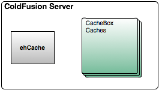

# Single Instance/In-Process

A single instance cache is an in-process cache that can be used within the same JVM heap as your application. In the ColdFusion world, this cache topology is what ColdFusion 9 actually offers: An instance of ehCache that spawns the entire JVM of the running ColdFusion server. There are pros and cons to each topology and you must evaluate the risks and benefits involved with each approach.

Definitely having a single instance approach is the easiest to setup and use. However, if you need to add more ColdFusion instances or you need to cluster your system, single instance will not be of much use anymore as servers will not be synchronized with the same cached data. CacheBox also allows you to create as many instances of itself as you need and also as many CacheBox caches as you need. This allows you great flexibility to create and configure multiple instance caches in a single ColdFusion server instance. This way if you are in shared hosting you do not have to worry about the underlying cache configuration \(which is only 1\), but you can configure your caching engines for your application ONLY! This is of great benefit and greater flexibility than dealing with a single cache instance on the ColdFusion server.

## Benefits:

* Fast access to data as it leaves in the same processes
* Easy to setup and configure
* One easy configuration if you are using ColdFusion 11 or Lucee
* You can also have multiple CacheBox caching providers running on one machine \(Greater Flexibility\)
* You can also have multiple CacheBox instances running on one machine or have a shared scope instance \(Greater Flexibility\)
* Each of your applications, whether ColdBox or not, can leverage CacheBox and create and configure caches \(Greater Flexibility\)

## Cons:

* Shared resources in a single application server
* Shared JVM heap size, thus available RAM
* Limited scalability
* Not fault tolerant

