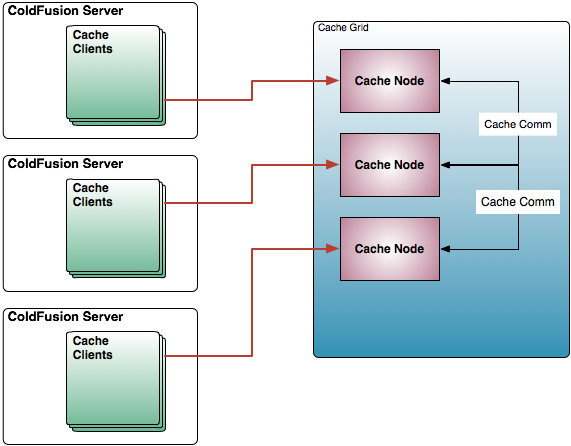

# Distributed

Distributed caching is the big daddy of scalability and extensibility. The crux concept is of partitioning the cache data across the members of the cache cluster and creating a grid of cached data that can scale rather easily. There are several major players out there like [EHCache](http://ehcache.org/) with Terracotta, [Oracle](http://www.oracle.com/technetwork/middleware/coherence/overview/index.html) [Coherence](http://www.oracle.com/technetwork/middleware/coherence/overview/index.html), and our favorite: [Couchbase NoSQL](http://couchbase.com/).

I suggest looking at all options to find what best suits your requirements. Please note that each vendor has their own flavor of distributed caching and might not match our diagram. Our diagram is just a visual representation for knowledge purposes.

## Ortus Couchbase Extension

[Ortus Solutions](https://www.ortussolutions.com/products/couchbase-lucee), the makers of CacheBox, have created a commercial extension for the open source CFML engine Lucee to support caching distribution features via Couchbase \([https://www.ortussolutions.com/products/couchbase-lucee](https://www.ortussolutions.com/products/couchbase-lucee)\).

> The Ortus Couchbase Extension is a Lucee Server Extension that allows your server to natively connect to a Couchbase NoSQL Server cluster and leverage it for built-in caching, session/client storage and distribution, and much more. With our extension you will be able to scale and extend your Lucee CFML applications with ease.

The extension will enhance your Lucee server with some of the following [capabilities](https://www.ortussolutions.com/#capabilities):

* Store session/client variables in a distributed Couchbase cluster
* Get rid of sticky session load balancers, come to the round-robin world!
* Session/client variable persistence even after restarts
* Ability to leverage the RAM resource virtual file system as a cluster-wide file system
* Cache connection capablities for providing distributed & highly scalable query, object, template, function caching
* [Much more](https://www.ortussolutions.com/#capabilities)

## Benefits:

* Extreme scalability
* Cache data can survive server restarts if one goes down, better redundancy
* Better cache availability through redundancy
* Higher storage availability
* Higher flexibility
* Your storage increases as more cluster members are added

## Cons:

* Harder to configure and setup \(Maybe, terracotta and ColdFusion 9 is super easy\)
* Not as much serialization and communication costs
* Could need load balancing

