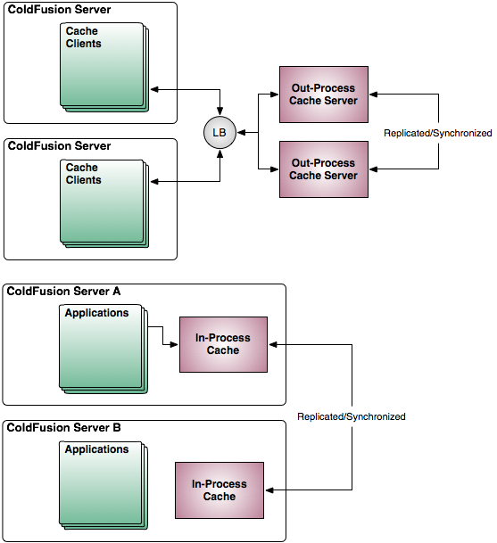

# Replicated

A replicated cache can exist in multiple application server machines and their contents will be replicated, meaning all caches will contain all the data elements. This type of topology is beneficial as it allows for all members in the application cluster to have availability to its elements. However, there are also some drawbacks due to the amount of chatter and synchronization that must exist in order for all data or cache nodes to have the same data fresh. This approach will provide better scalability and redundancy as you are not limited to one single point of failure. This replicated cache can be in-process or out-process depending on the caching engine you are using.

## Benefits:

* Better scalability
* Cache data can survive server restarts if one goes down, better redundancy
* Better cache availability through redundancy
* Higher storage availability
* Ideal for few application servers

## Cons:

* A little bit harder to configure and setup
* High serialization and network communication costs
* Could need load balancing
* Can scale on small amounts only

