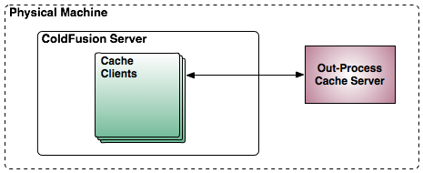

# Single Instance/Out-Process

A single instance can be an out-process cache that leaves on its own JVM typically in the same machine as the application server. This approach has also its benefits and cons. A typical example of an out of process cache can be using an instance of CouchDB for storage of your cache components and your applications talk to the cache via REST.

## Benefits:

* Still access is fast as it is in the same machine
* Easy to setup and configure
* Might require a windows or \*nix service so the cache engine starts up with the machine
* Can leverage its own JVM heap, memory, GC, etc and have more granularities.
* Out of process cache servers can be clustered also to provide you with better redundancy. However, once you start clustering them, each of those servers will need a way to replicate and synchronize each other.

## Cons:

* Still shares resources in the server
* Limited scalability
* Needs startup scripts
* Needs a client of some sort to be installed in the application server so it can function and a protocol to talk to it: RMI, JMS, SOAP, REST, etc.
* Not fault tolerant

