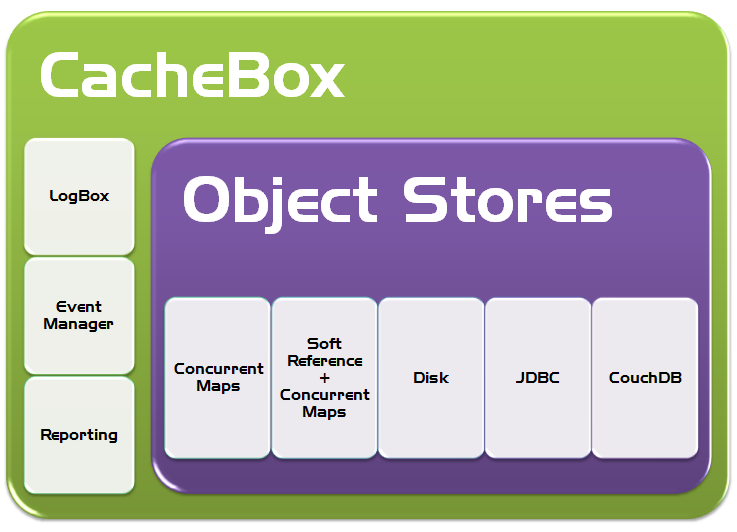

# Overview

## Cache Aggregator

CacheBox is a cache aggregator, in which you can aggregate different caching engines or types of the same engine into one single umbrella. It gives you built in logging \(via [LogBox](http://logbox.ortusbooks.com)\), an event model, synchronization, shutdown/startup procedures, reporting, interaction consoles and best of all a cache agnostic API.

CacheBox gives you the ability to manage and create your own, what we call Cache Providers that talk to different caching engines that you would like to configure in your applications. By aggregating them within CacheBox you get the added benefit of a rich event model for all caches to share, reporting and debugging.

## Caching API

These cache providers also share the same interaction API and thus gives you a nice level of abstraction, higher extensibility and flexibility when planning your applications or trying to scale them out.

You can build your applications based on this abstract API and then be able to configure the caches for your applications at runtime. This gives you greater flexibility and scalability when planning and writing your applications as they can be targeted for ANY CFML engine or version.

## The Enterprise Caching Engine

Caching has been a central concern in the ColdBox Platform since its very first version. We have always been concerned with mission critical applications, scalability and the ability to provide granular caching aspects to ColdFusion \(CFML\) applications within a single in-process caching engine.

Foremost, CacheBox behaves as an in-memory cache designed for objects, data, HTML fragments or anything you like. It has various tuning parameters such as default object timeout, default last access timeout, maximum objects to have in cache, a JVM memory threshold, a reaping frequency, eviction policies, an event model and so much more.

We also make use of object stores \(inspired by [EHCache](http://ehcache.org)\) for the CacheBox caching engine. This means that CacheBox can be configured to store its cached objects in different locations other than memory. This gives us great flexibility because we offer a wide gamut of storage options plus the concept of actually building your own storages. Currently we offer object stores based on concurrency classes, java soft references \(memory sensitive\), file storage, JDBC replication, and more coming soon.

### Cache Debugger & Reporter

We have a great cache debugger where you can visualize all your configured caches right from within your application. You can see the performance of the cache, the contents and even issue commands to the targeted cache provider.

